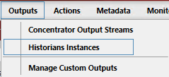
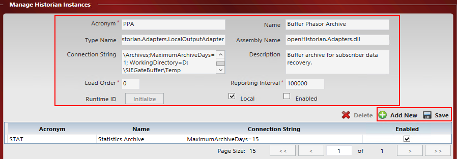
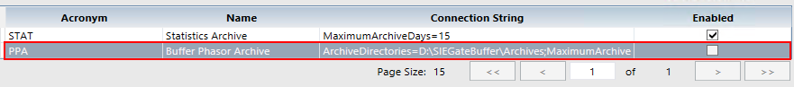
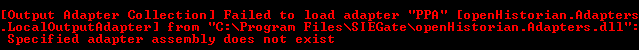
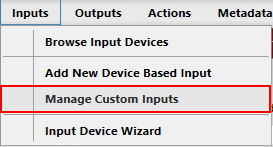
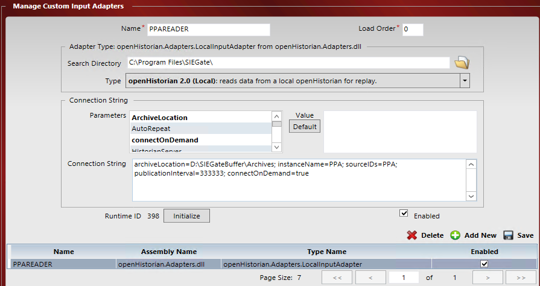
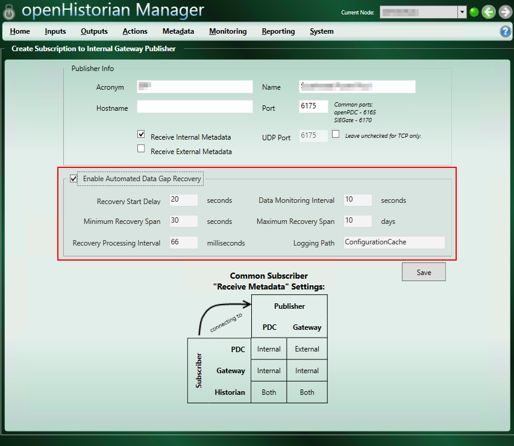

# Setting up Data Gap Recovery for SIEGate and openHistorian

These settings can be used to enable a _buffer_ archive in SIEGate
and create a subscription in openHistorian that has data recovery enabled.
This can be used to limit data loss on the subscriber side, openHistorian,
due to service restarts or failures. This does not prevent data loss from
a SIEGate restart or failure. For setting up a high availability (HA) SIEGate
set, see [[TODO: SIEGate High Availibility]].

OpenHistorian 2.0 archiver will be used to enable this functionality, as it
has a much lower disk IO and CPU utilization for the same number of data streams.

## Copy/Install openHistorian 2.0 libraries in SIEGate

As we will be using the openHistorian 2.0 archiver, a few libraries must be installed
in the SIEGate program directory. This list of files is from Dec, 2016 and is subject
to change. All needed files can be found in the openHistorian 2.0 program directory.
**Be sure to use releases from the same version of the Grid Solutions Framework (GSF)
and build date.** Other DLLs may be required, depending on your version. You may be able to
determine which dlls you need by comparing the openHistorian program folder and the SIEGate
program folder.

* GSF.SortedTreeStore.dll
* openHistorian.Core.dll
* openHistorian.Adapters.dll


## Enabling SIEGate buffer archive

The SIEGate Buffer archive uses the same internal archiving mechanism as
openHistorian 2.0, however it is configured to roll off after a specified time.
In this example we will be using a 24 hour archive. This will limit the amount of
disk space used and allow the archive to be high performance.

Notes: In this example we will be using `D:\SIEGateBuffer\Archives` as the archive
folder and `D:\SIEGateBuffer\Temp` as the working directory. You can change this
to fit your storage solution. The folder should be treated as buffer/cache data, prioritizing
IO and availablity vs long term capacity.

Open SIEGate Manager, and navigate to `Outputs\Historian Instances`.  
  
Click the `(+)Add New` button, and enter the following settings in the form.

|Setting|Value|
|-------|-----|
|Acronym|PPA|
|Name|Buffer Phasor Archive|
|Type Name|openHistorian.Adapters.LocalOutputAdapter|
|Assembly Name|openHistorian.Adapters.dll|
|Connection String|ArchiveDirectories=`D:\SIEGateBuffer\Archives`;MaximumArchiveDays=1; WorkingDirectory=`D:\SIEGateBuffer\Temp`|
|Description|Buffer archive for subscriber data recovery.|
|Load Order|0 _(default)_|
|Reporting Interval|100000 _(default)_|
|Local|Checked _(default)_|
|Enabled|_Leave **Unchecked** for now (default)_|



Click the `Save` button when done. There should be a new line in the list of historian
instances named 'PPA'.



Click the `Initialize` button, followed by checking the `Enabled` checkbox. Click `Save`.
If you are watching the SIEGate console and see the following error, be sure you copied
the dll files from step 1 _and_ the GSF versions match.  


## Configure SIEGate PPAREADER

Now that the buffer historian is set up, the PPAREADER in SIEGate must be
configured to use the openHistorian 2.0 libraries. In SIEGate Manager, navigate to
`Inputs\Manage Custom Inputs`.  
  

If, PPAREADER does not exist, create a new instance. Otherwise modify the existing instance
to use the following settings:

|Setting|Value|
|-------|-----|
|Name|PPAREADER|
|Load Order|0 _(default)_|
|Search Directory|C:\Program Files\SIEGate\ _(default)_|
|Type|**openHistorian 2.0 (Local)**|
|Connection String|archiveLocation=`D:\SIEGateBuffer\Archives`; instanceName=PPA; sourceIDs=PPA; publicationInterval=333333; connectOnDemand=true|



Once the form is complete, check `Enabled`, click `Save` and `Initialize`.
You may also need to restart the SIEGate service.

## Setting Measurements to be Archived

Finally, each measurment you wish to enable recovery for must have it's historian set to PPA.  
This can be done from the database for all measurements, or from the SIEGate Manager measurment page for individual measurments.

```sql
-- sample sql to set all measurements to be archived

-- Get the ID of the newly created historian instance
SELECT ID from Historian WHERE Acronym = 'PPA'; 

-- Update all measurments to use the ID of the new historian, 2 in this example.
UPDATE [SIEGate].[dbo].[Measurement]
SET [HistorianID] = 2
WHERE [PointID] in
(SELECT meas.PointID FROM [SIEGate].[dbo].[Measurement] meas
LEFT OUTER JOIN
[SIEGate].[dbo].[SignalType] sig ON meas.[SignalTypeID] = sig.[ID]
WHERE sig.[Acronym] != 'STAT');

```

## Enabling Data Recovery on openHistorian

On the openHistorian subscription side, you can enable data recovery when establishing
a new connection to SIEGate, or by adding the dataGapRecovery setting to the existing
connection string.



```javascript
// config string template
dataGapRecovery={
  enabled=true;
  recoveryStartDelay=<seconds>;
  dataMonitoringInterval=<seconds>;
  minimumRecoverySpan=<seconds>
  maximumRecoverySpan=<seconds>;
  recoveryProcessingInterval=<miliseconds>
};

// example
dataGapRecovery={enabled=true; recoveryStartDelay=20; dataMonitoringInterval=10; minimumRecoverySpan=30; maximumRecoverySpan=864000; recoveryProcessingInterval=66};
```
